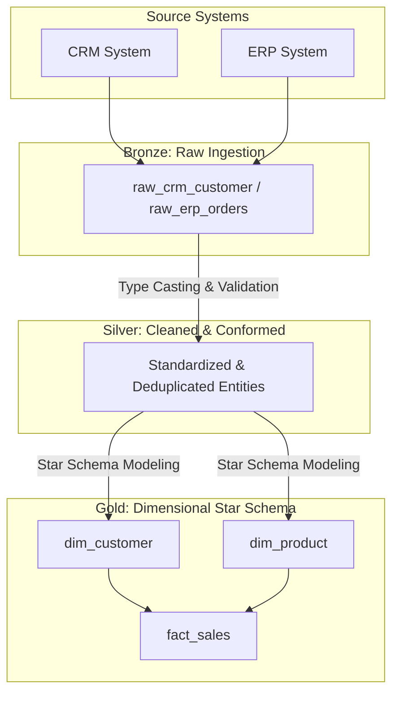

# 🚀 Enterprise SQL Data Warehouse & Lakehouse Project

[](https://www.postgresql.org/)
[](https://www.databricks.com/glossary/medallion-architecture)
[](https://github.com/HIMA6768/sql--data-warehouse-project)
[](https://opensource.org/licenses/MIT)

---

## 📖 The Story & Vision

Welcome to the **Enterprise SQL Data Warehouse** project! Modern organizations face a massive bottleneck: data arrives from disparate sources (CRM, ERP, Webhooks) in messy, unstructured, and error-prone formats. 

This project implements a robust **Modern Medallion Architecture (Bronze, Silver, Gold layers)** to ingest raw operational data, systematically clean and conform it, and finally model it into high-performance dimensional structures (Star Schema) optimized for Business Intelligence and analytical reporting.

---

## 🏗️ Data Architecture & Pipeline Flow

The data flows through three distinct analytical tiers, ensuring absolute data integrity, traceability, and business readiness.



# 📂 Layer Breakdown & Implementation

## 🥉 1. Bronze Layer (Raw Ingestion)
* **Objective:** Ingest raw data directly from source systems with zero transformations.
* **Naming Pattern:** `<sourcesystem>_<entity>`[cite: 1]
* **Characteristics:** All names must start with the source system name, and table names must match their original names without renaming[cite: 1].

## 🥈 2. Silver Layer (Cleaned & Integrated)
* **Objective:** Fix data anomalies, remove duplicates, handle missing values, and cast correct data types.
* **Naming Pattern:** `<sourcesystem>_<entity>`[cite: 1]
* **Characteristics:** All names must start with the source system name, and table names must match their original names without renaming[cite: 1].

## 🥇 3. Gold Layer (Business-Ready / Star Schema)
* **Objective:** Deliver high-performance, denormalized data structures optimized for BI dashboards (Power BI, Tableau) and analytics.
* **Naming Pattern:** `<category>_<entity>`[cite: 1]
* `dim_` -> Dimension table[cite: 1] (e.g., `dim_customer`, `dim_product`[cite: 1])
* `fact_` -> Fact table[cite: 1] (e.g., `fact_sales`[cite: 1])
* `report_` -> Report table[cite: 1] (e.g., `report_customers`, `report_sales_monthly`[cite: 1])


## 📐 Strict Naming Conventions

To maintain absolute uniformity across developers and pipelines, this project adheres to strict naming specifications:
* **Casing:** Strictly `snake_case` (lowercase letters with underscores `_`) for all schemas, tables, views, and columns.
* **Primary/Surrogate Keys:** Dimension primary keys always end with the `_key` suffix (e.g., `customer_key`, `product_key`)[cite: 1].
* **Technical Metadata:** System-generated audit columns always start with the `dwh_` prefix (e.g., `dwh_load_date`)[cite: 1].
* **ETL Procedures:** Load scripts and stored procedures follow the `load_<layer>` format (e.g., `load_bronze`, `load_silver`, `load_gold`)[cite: 1].

---

## 📊 Gold Layer Data Catalog Summary

| Layer | Table Name | Type | Description |
| :--- | :--- | :--- | :--- |
| **Gold** | `gold.dim_product` | Dimension[cite: 1] | Product descriptive attributes, categories, subcategories, and SCD tracking. |
| **Gold** | `gold.dim_customer` | Dimension[cite: 1] | Customer demographic details, geography, and segmentation attributes. |
| **Gold** | `gold.fact_sales` | Fact Table[cite: 1] | Transactional metrics, foreign keys (`customer_key`[cite: 1], `product_key`), quantities, and amounts. |

---

## 🛠️ Tech Stack & Tools

* **Database Management System:** PostgreSQL
* **Query & Execution:** pgAdmin / VS Code SQL Tools
* **Modeling Paradigm:** Dimensional Modeling (Star Schema)
* **Version Control:** Git & GitHub

---

## 💻 Getting Started

1. Clone the repository:
   ```bash
   git clone [https://github.com/HIMA6768/sql--data-warehouse-project.git](https://github.com/HIMA6768/sql--data-warehouse-project.git)


   ---

## 👨‍💻 Developed by Himadri
